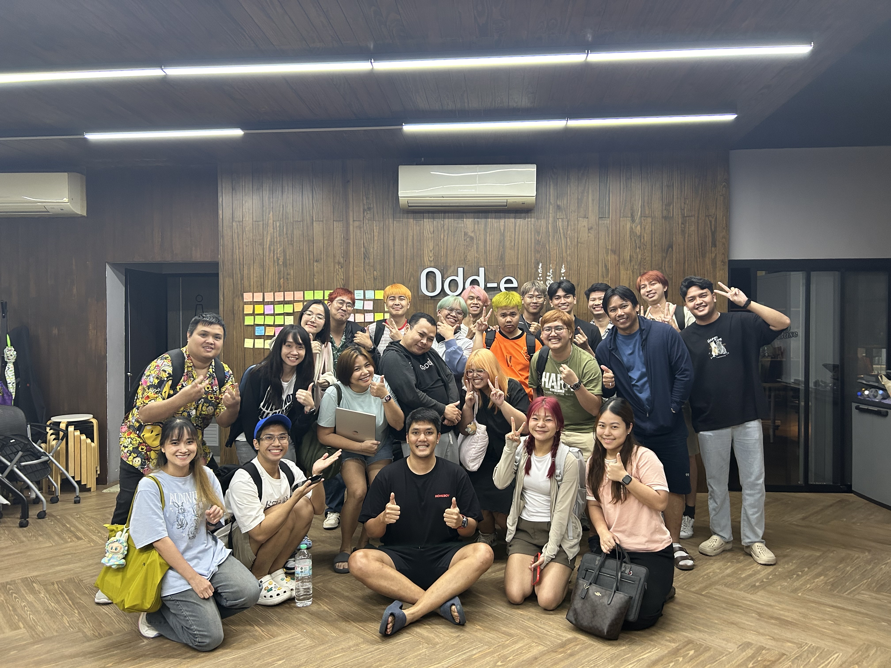
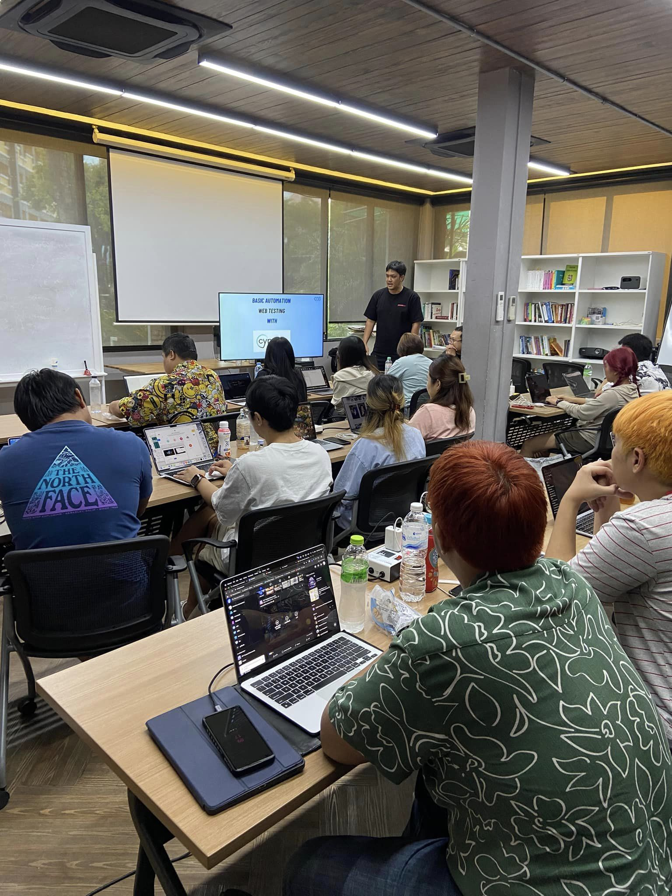

## Goals for this year

* Improve yourself to learn new programming language or new tech tool.
* Increase coding skills.
* Teach Assistant some class at GeekyBase on topic about : Test principle or Automation test.

## Goals for next year

* TBD

## Projects

* TBD

## Project (ThaiBev)

##### Plus Order Scheduling(PlusOS) [Team Hypnos]
* Web application that hand on about orders of HAVI Logistic

- Technology Stack
    - Frontend
        - Vue3
        - TypeScript
    - Backend
        - Golang
    - Database
        - MongoDB
    - Deployment
        - Gitlab CI/CD
        - Docker
        - k8s
    - Testing tools
        - Cypress
        - Jest

## Collaboration & mentorship
__

## Design & documentation
__

## Company building

* Hosted Class `Basic Automation Web Testing with Cypress` @ GeekyBase (Internal Class)
** 
**  

## What you learned

* Training : Domain Driven Design by P' Ruuf
* [Training : Playwright - Hands On #2 @ GeekyBase](images/certificates/certificate.pdf)
* Training : Non-Violent Communication (NVC) by P'Jua

## Outside of work
__