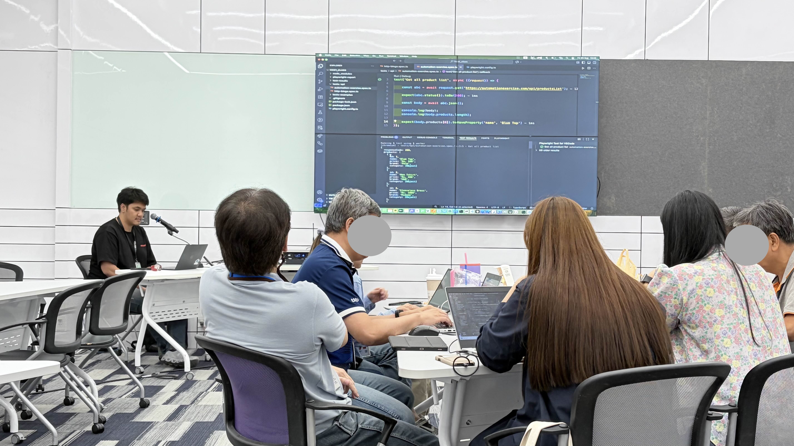

## Goals for this year

* Upskill & Reskill about Automation test knowledge.

## Goals for next year

* TBD

## Project (ttb)

##### FINOVA team Branch API
* team BranchAPI develop plug-in services for call Core Banking systems helping `FINOVA` manage APIs.

- Technology Stack Hands-on
    - Testing tools
        - Playwright
        - Postman
    - Database
        - Microsoft SQL
    - Operations tools
        - Bitbucket
        - Jenkins

## Collaboration & mentorship
__

## Design & documentation
__

## Company building

* TBD

## What you learned

* Training : Containers Fundamentals By P'dear & N'bas
* Training : Wardley Mapping for X By P'chonla

## Outside of work

* Hosted Class `API Testing with Postman` @ ttb Head Quarter (Class for Client for QA Internal)

* Hosted Class `API Testing with Playwright` @ ttb Head Quarter (Class for Client for QA Internal)

